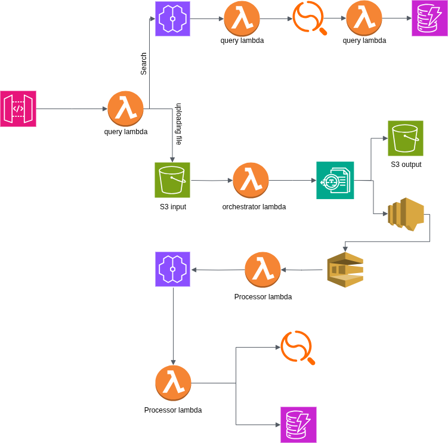

# 🧠📄 DocuInsight AI — My Serverless Document Brain!

A cloud-native, AI-powered document processing pipeline that reads, understands, and answers questions from your documents — built entirely on AWS Free Tier using Terraform and Python.

---

## 🚀 What is This Project?

**DocuInsight AI** is my personal attempt to build a smart document system — something that reads PDFs or images, understands the content inside, and lets you query them in plain English.

I've been applying to companies like **Amazon** and **Google**, and I wanted to showcase more than just certifications — this is my real-world project that blends cloud engineering and machine learning.

---

## 🧠 The Big Idea

> “Wouldn’t it be awesome if I could just *drop a file* somewhere and then *ask questions* like:  
> _What is the total amount on that invoice from last month for Acme Corp?_”

That’s the goal. DocuInsight AI makes it possible by:

- Extracting text, forms, and tables using OCR.
- Generating embeddings (AI-understandable vectors).
- Storing all the data in smart search-friendly formats.
- Allowing natural language Q&A over documents via an API.

---

## 🖼️ Architecture Overview

> A simplified sketch of how everything fits together.



---

## 🛠️ Technologies Used

| Category           | Tools/Services                                                                 |
|-------------------|---------------------------------------------------------------------------------|
| **Cloud Platform** | AWS (Amazon Web Services)                                                       |
| **IaC**            | Terraform                                                                      |
| **CI/CD**          | GitHub Actions                                                                 |
| **Storage**        | Amazon S3 (input & output buckets)                                              |
| **OCR & AI**       | Amazon Textract, Amazon SageMaker (Serverless Inference, sentence-transformers)|
| **Database**       | Amazon DynamoDB (metadata), Amazon OpenSearch (vector + keyword search)        |
| **Compute**        | AWS Lambda (Python)                                                             |
| **API Gateway**    | Amazon API Gateway (RESTful interface)                                         |
| **Messaging**      | Amazon SNS & SQS (async pipeline handling)                                     |
| **Monitoring**     | Amazon CloudWatch (logs & metrics)                                             |

---

## 🧑‍💻 Getting Started

### ✅ Prerequisites

- [AWS CLI](https://docs.aws.amazon.com/cli/latest/userguide/install-cliv2.html)
- [Terraform CLI](https://developer.hashicorp.com/terraform/downloads)
- [Python 3.x](https://www.python.org/downloads/)
- [Git](https://git-scm.com/)
- [Docker Desktop](https://www.docker.com/products/docker-desktop/)

### 🧰 Setup & Deployment

```bash
git clone https://github.com/your-username/DocuInsight-AI.git
cd DocuInsight-AI
